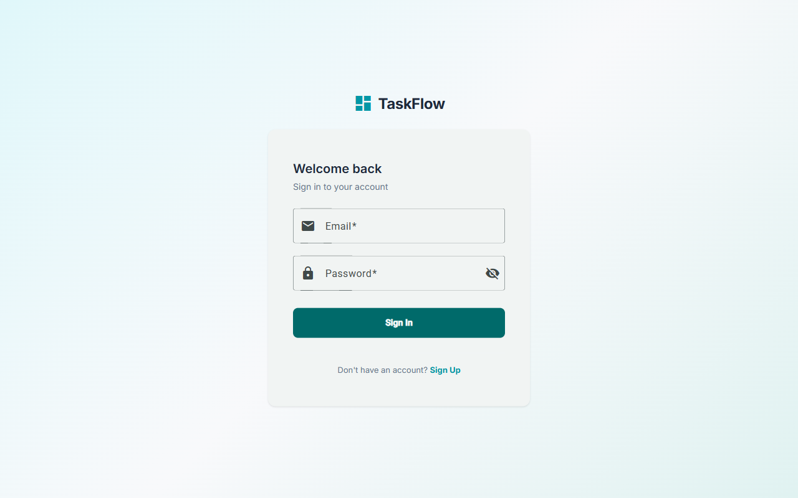
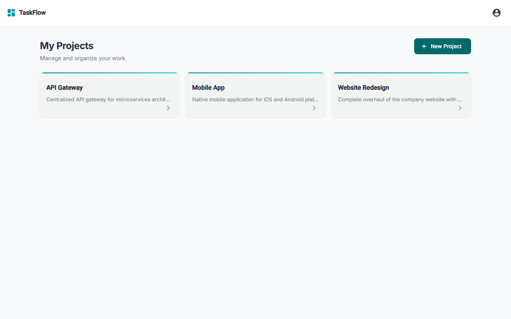
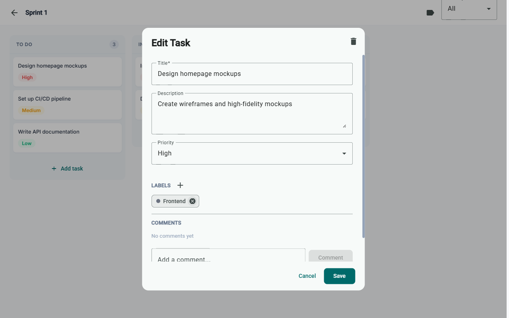

# Task Flow

A full-stack task and project management application (mini Jira) with Kanban boards, drag-and-drop, comments, labels, and JWT authentication.

## Tech Stack

**Backend:** Go 1.24 with Chi v5 router, pgx v5 (PostgreSQL driver), JWT authentication
**Frontend:** Angular 19 (standalone components), Angular Material, Angular CDK drag-and-drop
**Database:** PostgreSQL 16
**DevOps:** Docker Compose, multi-stage Dockerfiles

## Features

- User registration and login with JWT access/refresh token rotation
- Project CRUD with automatic board and column creation
- Kanban board with drag-and-drop task management
- Fractional indexing for O(1) position updates
- Task filtering by priority
- Comment threads on tasks (create, edit, delete)
- Project labels with color picker and task association
- User profile page
- Responsive Material Design UI

## Project Structure

```
task-flow/
├── backend/                  # Go REST API
│   ├── cmd/api/              # Application entrypoint
│   ├── internal/
│   │   ├── config/           # Environment configuration
│   │   ├── domain/           # Domain models and repository interfaces
│   │   ├── handler/          # HTTP handlers (controllers)
│   │   ├── middleware/       # Auth and logging middleware
│   │   ├── repository/       # PostgreSQL implementations
│   │   └── service/          # Business logic layer
│   └── migrations/           # SQL migration files
├── frontend/                 # Angular 19 SPA
│   └── src/app/
│       ├── core/             # Auth, API services, guards, interceptors
│       └── features/         # Lazy-loaded feature modules
│           ├── auth/         # Login/Register
│           ├── board/        # Kanban board with drag-and-drop
│           ├── profile/      # User profile
│           └── projects/     # Project list and detail
└── docker-compose.yml        # Development environment
```

## Screenshots

### Login
Clean authentication page with gradient background and branded header.



### Projects Dashboard
Project cards with hover effects, accent stripes, and priority-based organization.



### Kanban Board
Drag-and-drop board with color-coded priority badges and column task counts.


### Task Editor
Edit tasks with labels, comments, and priority — all within a polished dialog.



## Getting Started

### Prerequisites

- Go 1.24+
- Node.js 20+
- PostgreSQL 16+ (or Docker)

### Quick Start with Docker

```bash
cp backend/.env.example backend/.env  # create .env from template, then edit as needed
docker compose up -d
```

This starts:
- **API** at `http://localhost:3080` (with hot-reload via Air)
- **Frontend** at `http://localhost:4201`
- **PostgreSQL** at `localhost:5439`

### Manual Setup

**Database:**

If using Docker Compose, the database is created automatically (`POSTGRES_DB: project_management`). Just run migrations:

```bash
cd backend
for f in migrations/*.up.sql; do
  docker compose exec -T db psql -U postgres -d project_management -f - < "$f"
done
```

If using a local PostgreSQL installation:

```bash
psql -U postgres -c "CREATE DATABASE project_management;"

cd backend
for f in migrations/*.up.sql; do psql -U postgres -d project_management -f "$f"; done
```

**Backend:**

```bash
cd backend
cp .env.example .env   # Edit with your DB credentials
go mod download
go run ./cmd/api
```

**Frontend:**

```bash
cd frontend
npm ci
npx ng serve
```

Open `http://localhost:4201` in your browser.

## Testing

### Quick Start

```bash
make test            # Run all tests (backend + frontend)
make test-backend    # Run backend tests only
make test-frontend   # Run frontend tests only
make lint            # Run all linters
```

### Backend Tests

The Go backend uses the standard `testing` package with `httptest` for HTTP handler tests and hand-written mock interfaces for service-layer tests.

```bash
cd backend
go test ./...                              # Run all tests
go test -v -race ./...                     # Verbose with race detection
go test -v -race -coverprofile=cover.out ./...  # With coverage report
go tool cover -html=cover.out              # View coverage in browser
```

**Test structure:**

| Layer | Pattern | Example |
|-------|---------|---------|
| Handler | `httptest.NewRequest` + `httptest.NewRecorder` | `handler/health_test.go` |
| Response | Table-driven tests for error mapping | `handler/response_test.go` |
| Service | Mock repository interfaces | `service/project_service_test.go` |

### Frontend Tests

The Angular frontend uses **Jasmine** + **Karma** with `HttpClientTestingModule` for service tests and `TestBed` for component tests.

```bash
cd frontend
npm test                                        # Watch mode
npx ng test --watch=false --browsers=ChromeHeadless  # CI mode (headless)
npx ng test --code-coverage                     # With coverage report
```

Coverage reports are generated in `frontend/coverage/`.

**Test structure:**

| Layer | Pattern | Example |
|-------|---------|---------|
| Service | `HttpTestingController` + request assertions | `core/api/project.service.spec.ts` |
| Guard | `TestBed.runInInjectionContext` + spy objects | `core/auth/auth.guard.spec.ts` |
| Component | `TestBed` + fixture + signal assertions | `features/projects/project-list/project-list.component.spec.ts` |

### E2E Tests

End-to-end tests use **Playwright** and require the full stack running locally.

```bash
cd e2e
npm test                # Run headless
npm run test:headed     # Run with browser visible
```

Test suites cover authentication, project management, and kanban board workflows.

### CI/CD

GitHub Actions run automatically on push to `main` and on pull requests:

- **Backend CI** (`.github/workflows/backend-ci.yml`): Lint (golangci-lint) → Test (with PostgreSQL, race detection, coverage) → Build
- **Frontend CI** (`.github/workflows/frontend-ci.yml`): Lint (ESLint) → Test (Karma headless, coverage) → Build

Both pipelines upload coverage artifacts to GitHub Actions.

## API Endpoints

### Auth (Public)
| Method | Path | Description |
|--------|------|-------------|
| POST | `/api/v1/auth/register` | Register new user |
| POST | `/api/v1/auth/login` | Login |
| POST | `/api/v1/auth/refresh` | Refresh access token |
| POST | `/api/v1/auth/logout` | Logout |

### Profile (Authenticated)
| Method | Path | Description |
|--------|------|-------------|
| GET | `/api/v1/me` | Get current user |
| PATCH | `/api/v1/me` | Update profile |

### Projects
| Method | Path | Description |
|--------|------|-------------|
| POST | `/api/v1/projects` | Create project |
| GET | `/api/v1/projects` | List my projects |
| GET | `/api/v1/projects/:id` | Get project |
| PATCH | `/api/v1/projects/:id` | Update project |
| DELETE | `/api/v1/projects/:id` | Delete project |

### Boards & Columns
| Method | Path | Description |
|--------|------|-------------|
| POST | `/api/v1/projects/:id/boards` | Create board |
| GET | `/api/v1/projects/:id/boards` | List boards |
| GET | `/api/v1/boards/:id` | Get board |
| POST | `/api/v1/boards/:id/columns` | Create column |
| GET | `/api/v1/boards/:id/columns` | List columns |

### Tasks
| Method | Path | Description |
|--------|------|-------------|
| POST | `/api/v1/columns/:id/tasks` | Create task |
| GET | `/api/v1/boards/:id/tasks` | List tasks (supports filters) |
| PATCH | `/api/v1/tasks/:id` | Update task |
| PUT | `/api/v1/tasks/:id/move` | Move task (column + position) |
| DELETE | `/api/v1/tasks/:id` | Delete task |

### Comments
| Method | Path | Description |
|--------|------|-------------|
| POST | `/api/v1/tasks/:id/comments` | Add comment |
| GET | `/api/v1/tasks/:id/comments` | List comments |
| PATCH | `/api/v1/comments/:id` | Edit comment |
| DELETE | `/api/v1/comments/:id` | Delete comment |

### Labels
| Method | Path | Description |
|--------|------|-------------|
| POST | `/api/v1/projects/:id/labels` | Create label |
| GET | `/api/v1/projects/:id/labels` | List project labels |
| DELETE | `/api/v1/labels/:id` | Delete label |
| POST | `/api/v1/tasks/:id/labels` | Add label to task |
| DELETE | `/api/v1/tasks/:tid/labels/:lid` | Remove label from task |
| GET | `/api/v1/tasks/:id/labels` | List task labels |

## Environment Variables

```env
# backend/.env
DB_HOST=localhost
DB_PORT=5439
DB_USER=postgres
DB_PASSWORD=postgres
DB_NAME=project_management
DB_SSLMODE=disable
SERVER_PORT=8080
JWT_SECRET=your-secret-key
JWT_ACCESS_EXPIRY=15m
JWT_REFRESH_EXPIRY=168h
CORS_ORIGINS=http://localhost:4201
```

## Architecture Decisions

- **Chi v5** - stdlib-compatible router, zero external deps, idiomatic Go
- **pgx v5** - High-performance PostgreSQL driver (no ORM overhead)
- **Clean Architecture** - domain/service/handler/repository layers with interfaces
- **Fractional Indexing** - FLOAT positions for O(1) drag-and-drop reordering
- **JWT + Refresh Rotation** - 15min access tokens, 7-day refresh with rotation
- **Angular Standalone** - No NgModules, tree-shakable, lazy-loaded routes
- **Signals** - Angular signals for reactive UI state

## License

MIT
